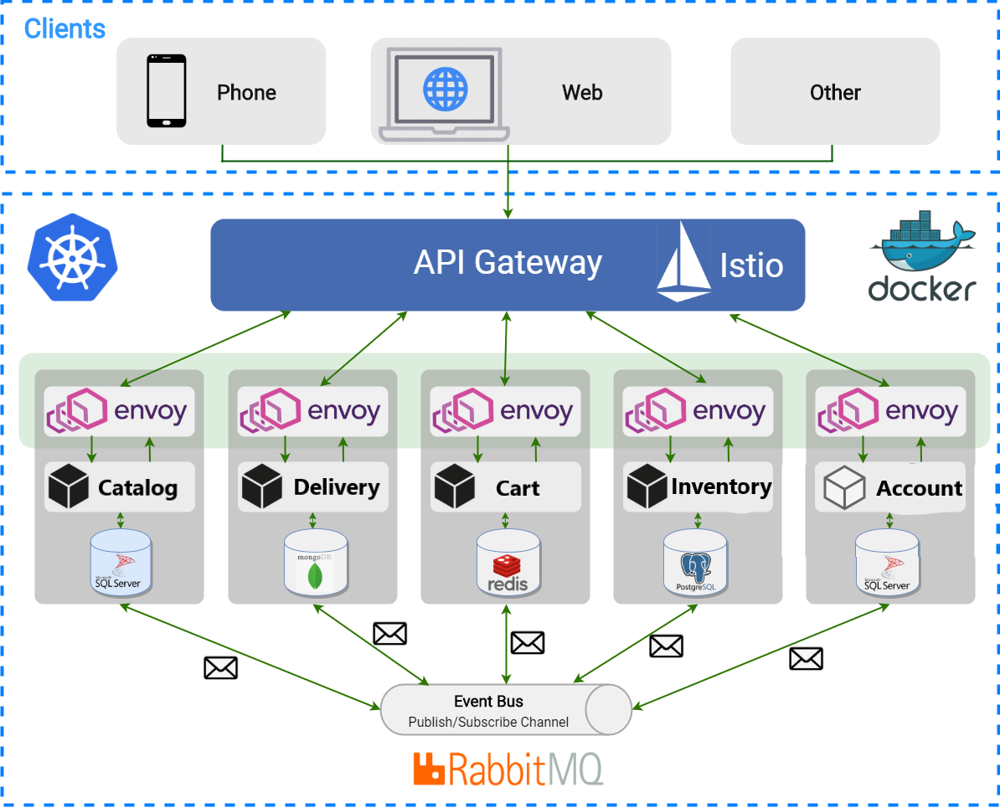

# SampleEcommerce App 

SampleEcommerce is a sample .NET Core reference application based on a simplified microservices architecture and Docker containers. 
The project demonstrates how to develop small microservices for larger applications using containers, orchestration, service discovery, gateway, and best practices. 
You are always welcome to improve code quality and contribute it, if you have any questions or issues don't hesitate to ask.

# What is Microservices Architecture?

The microservices architecture style is an approach for developing small services each running in its process. It enables the continuous delivery/deployment of large, complex applications. It also allows an organization to evolve its technology stack.

# Why Microservices Architecture?

Microservices came in a picture for building systems that were too big. The idea behind microservices is that there are some applications which can easily build and maintain when they are broken down into smaller applications which work together. Each component is continuously developed and separately managed, and the application is then merely the sum of its constituent elements. Whereas in traditional “monolithic” application which is all developed all in one piece.

# Motivation

- Developing separately deployable and scalable micro-services based on best practies using containerization
- Developing cross-platform beautiful mobile apps using Xamarin.Forms
- Developing Single Page applications using React and including best practices
- Configuring fully automated CI/CD pipelines using Github Actions to mono-repo and Azure Pipelines and AppCenter for mobile
- Using modern technologies such as GraphQL, gRPC, RabbitMQ, Service meshes
- Writing clean, maintainable and fully testable code, Unit Testing, Integration Testing and Mocking practices
- Using SOLID Design Principles

# Architecture overview

- Distributed architecture. All the services communicate with the api gateway through REST or RPC. These services can be deployed as multiple instances, and the requests can be distributed to these instances.
- Separately deployed components. Each component is deployed separately. If one component needs changes, others don’t have to deploy again.
- Service components. Services components communicate with each other via service discovery
- Bounded by contexts. It encapsulates the details of a single domain, and define the integration with other domains. It is about implementing a business capability.

